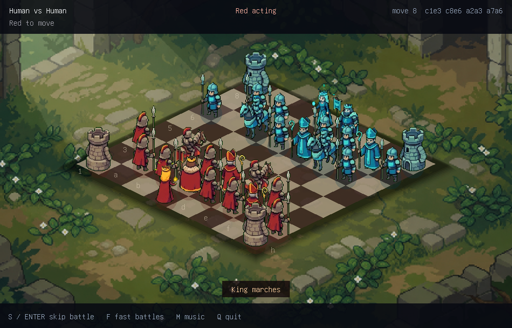

# Chess Bash

[](https://github.com/itsmygithubacct/chess-bash/actions/workflows/ci.yml)
[](LICENSE)

Animated isometric chess for Linux terminals that implement the Kitty graphics
protocol. Chess Bash is written in C and renders a software framebuffer directly
in the terminal—no desktop window or GUI toolkit required.



Pieces march across the battlefield, captures become short animated duels, and
each match has music, sound cues, screen shake, six environments, and a complete
set of chess rules.

## Features

- Castling, en passant, promotion, checkmate, stalemate, fifty-move rule,
  threefold repetition, insufficient material, and resignation
- Human vs Human, Human vs Computer, and Computer vs Computer modes
- Three difficulty levels, backed by Stockfish when available and a built-in
  fallback engine otherwise
- Six boardless battlefield themes framing a centered isometric game board
- Directional armies, walk and battle animation, captured-piece trays, move
  history, legal-move markers, check feedback, and a victory sequence
- Music with crossfades and seven multi-variation sound-effect banks, plus fast
  and skippable battles
- Blue-side rotation, terminal resizing, compact layouts, and asynchronous AI

## Requirements

- Linux
- A C11 compiler, `make`, and zlib development headers
- A terminal implementing the Kitty graphics protocol

Kilix is the primary tested terminal. Kitty should work directly; WezTerm,
recent Konsole releases, and Ghostty also implement the protocol, but terminal
versions and multiplexer passthrough can affect compatibility.

On Debian or Ubuntu:

```sh
sudo apt install build-essential zlib1g-dev kitty
```

Audio is optional. Chess Bash uses the first available command from `pacat`,
`pw-play`, `aplay`, or SoX `play`; without one it runs silently. For example:

```sh
sudo apt install alsa-utils
```

Stockfish is also optional. The built-in engine is used when it is unavailable.
Published releases are source-only; building on the target system avoids libc
and architecture compatibility surprises.

## Build and run

```sh
make
./chess-bash
```

To install under your account:

```sh
make install PREFIX="$HOME/.local"
```

System-wide installation defaults to `/usr/local`:

```sh
sudo make install
```

If Stockfish is installed somewhere outside `PATH`, provide its executable:

```sh
STOCKFISH=/usr/games/stockfish ./chess-bash
```

## Controls

| Key | Action |
|-----|--------|
| Arrows / WASD | Move cursor or navigate the menu |
| Enter / Space | Select, confirm, or skip the active battle |
| Esc | Clear selection or cancel promotion |
| R | Resign (press twice); rematch after the game |
| M | Toggle music |
| F | Toggle fast battles |
| S | Skip the active battle |
| N | Return to menu (press twice during a live game) |
| Q | Quit |

## Troubleshooting

- **Graphics probe fails:** run directly in an up-to-date Kitty-protocol
  terminal. `CHESS_BASH_SKIP_PROBE=1` bypasses the check only when you already
  know the terminal is compatible.
- **Running through SSH or tmux:** Kitty graphics escape sequences must pass
  through unchanged. Try a direct local terminal session first when diagnosing.
- **No sound:** install one of `pacat`, `pw-play`, `aplay`, or `play`, then run
  `./chess-bash --sound-test`.
- **Assets are not found:** installed builds locate their shared asset directory
  automatically. Developers can override it with `CHESS_BASH_ASSETS=/path`.
- **Stockfish is not detected:** set `STOCKFISH=/full/path/to/stockfish`; gameplay
  remains available through the built-in engine.

## Development

```sh
make test
./chess-bash --rules-test
./chess-bash --perft-test
./chess-bash --fallback-test
./chess-bash --selftest 1337 160
./chess-bash --render-test 42
./chess-bash --sound-test
```

The test suite covers deterministic rule fixtures, standard perft positions,
random legal games, engine lifecycle behavior, required asset loading, every
battlefield theme, compact and rotated layouts, animation states, and staged
installation in CI.

`--render-test` writes visual snapshots beneath `CHESS_BASH_RENDER_DIR` when it
is set, or to the current directory otherwise. `--sound-test` plays every sound
bank in sequence, including the check warning.

Kitty presentation and audio voice/music mixing use vendored
`kitty-framebuffer` and `pcm-mixer` copies under `third_party/`. Chess Bash's
isometric sprite renderer remains game-specific.

## Assets and license

Chess Bash code, project-specific art, and deterministic music are released
under the [MIT License](LICENSE) to the extent applicable. The bundled gameplay
SFX in `assets/sfx/` are locally generated and CC0-derived, with no
standalone-use restriction. The embedded terminal font retains its permissive
upstream notice. See the public [asset provenance and licensing
manifest](docs/asset-sources.md) for details.

See [CHANGELOG.md](CHANGELOG.md) for release notes.
